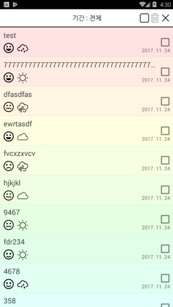

### 프로젝트명: 한줄일기장

팀원 수: 4명 
개발 기간: 1달 
나의 역할: 코딩, 다이어그램 

사용 언어: Java 
사용 SDK: Android SDK 
사용 라이브러리: MPAndroidChart 3.0.1 
사용 툴: Android Studio 3.0 

### 프로그램 설명

- 날씨와 기분을 같이 기록하는 메모장
- 작성한 모든 메모를 작성 날짜 순으로 정렬 
특정 기간에 작성한 메모만 확인 가능
- 날씨와 기분을 통계로 확인 가능 
통계를 원하는 기간의 설정도 가능

### 동작 과정
- 메모 추가
  1. 메인 화면의 연필 아이콘을 눌러 메모 작성/수정 화면으로 이동한다.
  2. 상단의 날씨, 기분을 지정하고 메모 내역을 작성한다.
  3. 추가 버튼을 누르면 DB에 추가되고, 이후 메인 화면에서 확인이 가능
- 메모 수정
  1. 메인 화면에서 수정을 원하는 메모를 눌러 나오는 다이얼로그에서 수정을 누르면 메모 작성/수정 화면으로 이동한다.
  2. 날씨와 기분, 메모의 내용을 수정한 후 수정 버튼을 누르면 DB 수정 후 메인 화면에서 확인이 가능
- 메모 삭제
  - Case 1(단일 삭제)
    1. 메인 화면에서 삭제를 원하는 메모를 눌러 나오는 다이얼로그에서 삭제를 누르면 메모가 삭제된다.
  - Case 2(다중 삭제)
    1. 메인 화면의 휴지통 아이콘을 누르면 메모 옆에 체크박스가 뜬다.
    2. 삭제를 원하는 메모를 선택 후 휴지통 아이콘을 누르면 선택한 메모가 삭제된다.
- 메모 검색
  1. 메인 화면 상단의 날짜를 누르면 나오는 다이얼로그에서 From, To 기간을 설정한다.
  2. 적용을 누르면 설정한 기간 내의 메모를 리스트에 표시한다. 
  모두 보기를 누르면 전체 메모를 표시하고 취소를 누르면 리스트를 유지한다.
- 통계 보기
  1. 메인 화면의 차트 아이콘을 누르면 나오는 다이얼로그에서 From, To 기간을 설정한다.
  2. 적용을 누르면 설정한 기간 내의 날씨와 기분의 통계를 원형 그래프로 표시한 화면으로 이동한다. 
  모두 보기를 누르면 전체 기간의 통계를 보여주고 취소를 누르면 아무것도 하지 않는다.
  3. 원형 그래프를 터치하면 터치한 부분의 이름과 회수를 그래프 중앙에 표시한다.

### 주요 기능

- 메모 리스트
  - DB에서 메모 내역을 가져와 어댑터에 넣어서 리스트뷰에 반영
  - 인덱스 위치에 따라 다른 배경색을 적용(파스텔 톤 그라데이션)
  - 삭제 중이 아닐 시 체크박스의 체크를 해제하고 GONE 상태로 변경
  - 메모 선택 시 날씨와 기분, 메모 내역을 표시하는 다이얼로그를 띄움 
  구분을 위해 선택한 메모와 동일한 배경색을 적용 
  (버튼 - 수정: 수정 화면으로 이동 | 삭제: DB에서 제거 후 리스트에 반영 | 확인: 다이얼로그를 종료)
  - 상단의 기간 터치 시 기간 설정 다이얼로그를 표시 
  기간 설정 후 적용을 누르면 설정한 기간 내의 메모만 리스트에 표시

- 메모 추가/수정 화면
  - 연필 아이콘을 통해 들어온 경우는 추가 기능, 수정 버튼을 통해 들어온 경우는 수정 기능으로 동작 
  추가인 경우 초기 설정 값과 추가 버튼, 수정인 경우 해당 메모의 값과 수정 버튼
  - 날씨와 기분 리스트를 어댑터에 넣어 스피너에 반영
  - 날씨, 기분, 메모 내역 작성 후 하단의 버튼을 누르면 추가(Insert)/수정(Update) 작업 수행 후 메인 화면으로 이동

- 메모 삭제
  - 휴지통 아이콘 선택 시 삭제 상태로 들어가고 UI를 변경(차트→빈 체크박스|검은 휴지통→회색 휴지통|연필→취소)
   취소 선택 시 아이콘 원상 복귀
  - 삭제 상태인 경우 메모 리스트의 우측에 체크박스를 생성 
  하나라도 체크가 되면 회색 휴지통이 빨갛게 변함 
  상단의 빈 체크박스 아이콘 선택 시 모든 체크박스를 체크 상태로 전환 후 체크된 체크박스 아이콘으로 변경 
  체크박스를 수동으로 모구 체크해도 동일하며 하나라도 체크해제 시 빈 체크박스 아이콘으로 변경
  - 빨간색으로 바뀐 휴지통 선택 시 체크된 메모들을 DB에서 삭제 후 리스트뷰를 업데이트 
  메모를 선택해서 뜨는 다이얼로그의 삭제 버튼을 누르면 해당 메모에 대해 동일 작업을 수행

- 날씨, 기분 통계
  - 차트 아이콘 선택 시 기간 설정 다이얼로그를 표시 
  기간 설정 후 적용을 누르면 설정한 기간에 해당하는 날씨와 기분의 개수를 DB에서 가져온 통계 화면에 전달
  - 받아온 개수 리스트로 날씨 통계 그래프와 기분 통계 그래프를 생성 
  그래프의 영역 터치 시 확대되며 그래프 중앙에 이름과 회수를 표시

### 겪었던 문제(기술)
- 체크박스를 체크했을 때 다른 체크박스도 같이 체크됨 
& 처음 보이는 영역 밖의 메모 선택 시 에러가 남
& 체크박스 선택 후 삭제 시 엉뚱한 게 삭제되거나 에러가 남
& ...
  - 리스트뷰가 보이는 영역만큼의 position 번호만 존재해서 생기는 문제였음(0,1,2,3,4,0,1,2,3...)
  - 어댑터 내에서는 bindView 함수 내의 Cursor 매개변수의 position을 얻어와서 사용하고 
  리스트뷰에서는 onItemClickListener→onItemClick 함수의 i 매개변수로 들어오는 인덱스를 사용해서 해결
- 체크박스 외의 영역을 클릭했을 때 토글이 되지 않음
& 체크 상태 변경 처리를 해도 동작하지 않거나 체크박스랑 관계없이 체크된 것으로 인식함
  - 해당 아이템을 정의한 뷰에 체크박스를 조작하는 기능이 없어서 생긴 문제였음
  - Checkable 인터페이스를 구현한 ConstraintLayout 클래스를 만들어 레이아웃에 적용하는 것으로 해결
- 스피너 리스트가 제대로 나오지 않음
  - 많은 시행착오 후 스피너와 스피너 아이템 양쪽에 별도의 배경을 지정하는 것으로 해결
- 엉뚱한 아이콘 이미지를 표시함
  - DB에 이미지의 resId를 넣어두고 사용했더니, 이미지를 추가하면서 Id가 변해서 생긴 문제였음
  - 그냥 코드 내에서 이미지 Id를 가져와서 사용하는 것으로 해결

---

### 잡담 및 소감
- &nbsp;처음엔 대략 2주 안으로 금방 끝날 줄 알았다. 
왜냐면 단순한 메모앱이었고 기술들도 찾아보니 예제들이 많았으니까. 
하지만...  
&nbsp;일단 예제들이 다 결과는 비슷한 거 같은데 방법이 다르고 일부만 소개되어 있었다. 
그래서 커스텀 리스트뷰를 만들 때 정말 스트레스를 많이 받았던 것 같다. 
BaseAdapter에 ArrayAdapter에 CursorAdapter에 ViewHolder에... 
어댑터마다 방식도 다 다르고 ViewHolder도 예제마다 사용 위치도 다르고... 
또 성능 때문에 ListView 말고 RecyclerView를 쓰라는데 너무 달라서 전혀 이해도 안가고... 
게다가 어떻게 완성을 하고 나니 정작 위에서 말한 인덱스랑 체크박스 문제도 겪었고... 
정말 이러다 못 만드는 거 아닌가 싶었다. 
그래서인지 제대로 돌아갔을 때 기뻐서 환호성까지 나왔었다.  
&nbsp;그러고보니 MySQL 대신에 그냥 SQLite를 쓰기로 결정하니까 되게 편했다. 
MySQL을 안쓰니 웹서버가 필요없고, 웹서버가 필요없으니 이클립스도 필요없다. 
개발툴을 하나만 쓰니 그리 편할 수가 없었다. 
물론 끝까지 하나만 쓴 건 아니고, DB 테스트가 안돼서 원인을 알기 위해 SQLite DB Browser도 잠깐 썼다. 
그 외에, 블루투스 기능도 없어서 순전히 앱플레이어로 테스트가 가능할거라 생각했는데 
의외로 앱플레이어랑 실제 안드로이드폰에서 나오는 결과물이 살짝 달랐었다. 
그런데 그게 알고보니 엉터리로 개발해서 그렇게 나온 걸 나중에 고치고 나서야 알았다.  
드디어 다 끝났다. 
중간이야 쳤지만 기말은 없고, 대신에 개별 발표(!!) 과제를 학기 동안 정해진 날짜에 하는 것으로 대신했다. 
덕분에 프로젝트 쪽 과목은 신경을 전혀 안쓰고 나머지만 신경쓰면 돼서 좋았다. 
일단은 쉬게 되어서 좋다.
